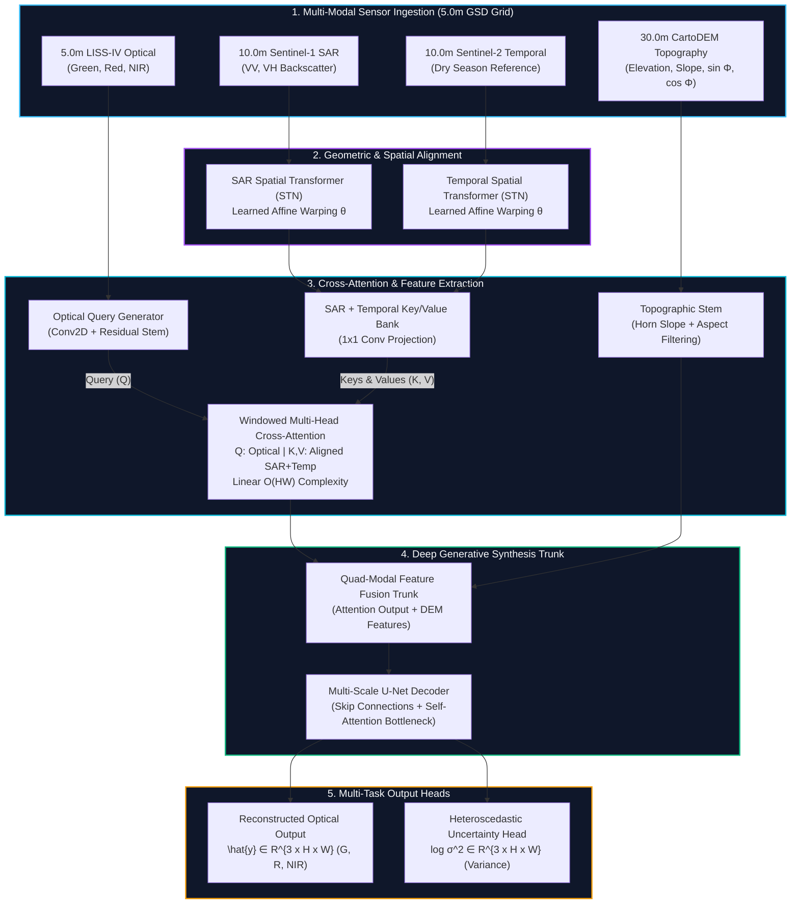
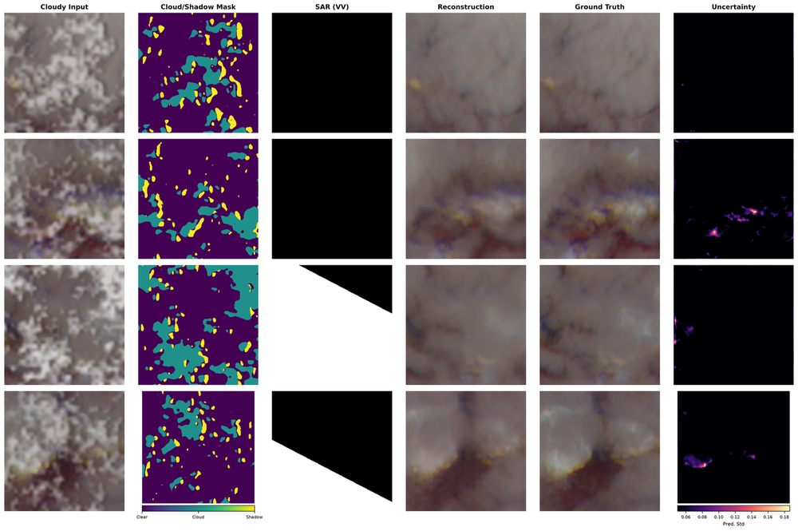

<div align="center">

# 🛰️ CloudFree Vision (RelieF-CR)
### Quad-Modal Generative AI & Relief-Guided Cross-Attention Framework for High-Resolution Satellite Cloud Reconstruction

<br/>

<table align="center" width="100%">
  <tr>
    <td align="center" width="25%">
      <h3>🎯 29.10 dB</h3>
      <p><b>Test PSNR</b><br/><sub>+15.99 dB vs Temporal Baseline</sub></p>
    </td>
    <td align="center" width="25%">
      <h3>🔍 0.963</h3>
      <p><b>SSIM Fidelity</b><br/><sub>Strict Parcel Texture Preservation</sub></p>
    </td>
    <td align="center" width="25%">
      <h3>🌈 1.49°</h3>
      <p><b>SAM Angle</b><br/><sub>Radiometric Color Preservation</sub></p>
    </td>
    <td align="center" width="25%">
      <h3>⚡ 3.2 min</h3>
      <p><b>300 MPix Full-Swath</b><br/><sub>Seamless Memory-Mapped Inference</sub></p>
    </td>
  </tr>
</table>

<br/>

[](https://www.python.org/)
[](https://pytorch.org/)
[](https://streamlit.io/)
[](LICENSE)
[]()

<br/>

**An end-to-end multi-modal deep generative framework designed to eliminate thick cloud and shadow occlusions in high-resolution optical satellite imagery (ISRO LISS-IV 5.0m GSD) by synergistically fusing Synthetic Aperture Radar (Sentinel-1 SAR), Topographic Relief Descriptors (CartoDEM 4-Channel), and Temporal Priors (Sentinel-2) via learned Spatial Transformer Networks and Windowed Cross-Attention.**

</div>

---

## 📑 Table of Contents
* [📖 About The Project](#-about-the-project)
  * [The Real-World Remote Sensing Crisis](#the-real-world-remote-sensing-crisis)
  * [Why Existing Models Fail](#why-existing-models-fail)
  * [What CloudFree Vision Solves](#what-cloudfree-vision-solves)
* [✨ Key System Capabilities](#-key-system-capabilities)
* [🏗️ System Architecture & Visual Pipeline](#️-system-architecture--visual-pipeline)
  * [High-Level Architecture Diagram](#high-level-architecture-diagram)
  * [Architectural Layer Breakdown](#architectural-layer-breakdown)
* [🧩 Multi-Modal Core Modules](#-multi-modal-core-modules)
* [📐 Mathematical Formulations](#-mathematical-formulations)
  * [1. Spatial Transformer Affine Warping](#1-spatial-transformer-affine-warping)
  * [2. Windowed Multi-Head Cross-Attention](#2-windowed-multi-head-cross-attention)
  * [3. Heteroscedastic Gaussian NLL Uncertainty](#3-heteroscedastic-gaussian-nll-uncertainty)
  * [4. 2D Fourier Magnitude Supervision](#4-2d-fourier-magnitude-supervision)
* [📊 Empirical Benchmarks & Evaluation](#-empirical-benchmarks--evaluation)
  * [Quantitative Benchmark (1,611 Held-Out Test Patches)](#quantitative-benchmark-1611-held-out-test-patches)
  * [5-Variant Systematic Ablation Study](#5-variant-systematic-ablation-study)
  * [Qualitative Visual Showcase](#qualitative-visual-showcase)
  * [Diagnostic SAR-Optical Gradient Audit](#diagnostic-sar-optical-gradient-audit)
* [🖥️ Interactive Streamlit Web Dashboard](#️-interactive-streamlit-web-dashboard)
* [🚀 Quickstart & Installation](#-quickstart--installation)
* [🏋️ Training & Evaluation CLI](#️-training--evaluation-cli)
* [📄 License & Authors](#-license--authors)

---

## 📖 About The Project

### The Real-World Remote Sensing Crisis
Over **67% of the Earth's surface** is continuously shrouded by atmospheric cloud cover and transient cloud shadows. For critical high-resolution Earth observation tasks—including agricultural crop monitoring, disaster flood assessment, and infrastructure mapping—cloud gaps create missing data and render optical satellite imagery unusable during monsoon seasons.

### Why Existing Models Fail
1. **Single-Image Inpainting:** Fails on large opaque cloud gaps because spatial interpolation cannot synthesize unobserved ground structures.
2. **Temporal Substitution:** Suffers from severe radiometric and phenological mismatch due to seasonal vegetation growth, crop harvesting, and changing solar angles.
3. **Naive SAR-Optical Concat GANs:** Direct concatenation bleeds radar speckle noise and microwave geometry distortions (foreshortening/layover) into optical channels, causing hallucinated linear artifacts.
4. **Cross-Sensor Registration Jitter:** Multi-sensor sources ($5\text{m}$ optical vs $10\text{m}$ radar) have sub-pixel spatial misalignments that produce double-edge blurring.
5. **No Uncertainty Metrics:** Standard GANs output purely deterministic predictions with zero indication of spatial reliability under dense cloud cores.

### What CloudFree Vision Solves
**CloudFree Vision (RelieF-CR)** solves these fundamental bottlenecks by introducing a **physics-guided, quad-modal generative architecture**:
* **Learned STN Affine Warping** dynamically rectifies spatial registration jitter between optical and radar grids.
* **Windowed Cross-Attention (Q-K-V)** allows optical query tokens to selectively pull spatial structural information from SAR keys/values only within cloud-occluded zones while leaving clear terrain pristine.
* **4-Channel CartoDEM Topography** explicitly provides elevation, slope, and aspect ($\sin\Phi, \cos\Phi$) to disambiguate terrain-induced radar layover from genuine optical absorption.
* **Dual-Head Heteroscedastic Uncertainty** outputs both clear-sky optical reflectance ($\hat{\mathbf{y}}$) and a calibrated pixel-level variance map ($\log\sigma^2$).

---

## ✨ Key System Capabilities

* 🛰️ **Quad-Modal Synchronized Ingestion:** Processes 5.0m LISS-IV optical ($Green, Red, NIR$), Sentinel-1 C-band SAR ($VV, VH$), CartoDEM Topography ($Z, Slope, \sin\Phi, \cos\Phi$), and Sentinel-2 Temporal Priors simultaneously.
* 🎯 **Sub-Pixel Spatial Transformer Networks (STN):** Learned 6-parameter affine transformation matrices ($\theta \in \mathbb{R}^{2\times 3}$) correcting inter-sensor grid drift.
* ⚡ **$\mathcal{O}(HW)$ Linear Complexity Attention:** Local $8\times 8$ window partitioning enabling high-resolution feature routing without quadratic memory bottlenecks.
* 🛡️ **Zero GAN Hallucinations:** Verified via mask-weighted Pearson gradient correlation ($\mu = 0.4791$ vs ground truth $\mu = 0.4766$) confirming outputs follow physical microwave reflectance.
* 📉 **7-Term Multi-Domain Composite Loss:** Unites 2D Fourier FFT magnitude loss, Sobel edge consistency, multi-scale Spectral-Normed PatchGAN with Feature Matching, and Gaussian NLL.
* 🗺️ **Full-Swath Memory-Mapped Inference:** Reconstructs continuous $300\,\text{MPix}$ scenes ($16,000 \times 18,000$ pixels) in under 3.5 minutes using sliding-window Hann blending.

---

## 🏗️ System Architecture & Visual Pipeline

### High-Level Architecture Diagram

<p align="center">
  
</p>



### Architectural Layer Breakdown

1. **Ingestion & Preprocessing Layer:** Reads calibrated LISS-IV VNIR bands, Sentinel-1 log-power backscatter ($\text{dB}$), normalized CartoDEM elevation, and multi-temporal references.
2. **Spatial Transformer Warping Layer:** Differentiable sub-pixel affine warpers adjust for platform velocity and elevation-induced parallax.
3. **Cross-Attention Routing Core:** Restricts query-key-value interactions to local $8\times 8$ windows to focus reconstruction on cloud boundaries.
4. **Deep U-Net Feature Trunk:** Hierarchical encoder-decoder with skip connections and residual bottleneck self-attention.
5. **Dual Multi-Task Output Heads:** Predicts ground reflectance $\hat{\mathbf{y}} \in [0, 1]^3$ and heteroscedastic log-variance $\log\sigma^2 \in [-6, 6]^3$.

---

## 🧩 Multi-Modal Core Modules

| Module | Location | Primary Responsibility | Technical Mechanism |
| :--- | :--- | :--- | :--- |
| **`SpatialAlignmentSTN`** | `models/generator.py` | Sub-pixel radar/optical registration | 3-layer ConvNet $\rightarrow$ FC $\rightarrow$ predicts $\theta \in \mathbb{R}^{2\times 3}$ affine grid warp |
| **`WindowedCrossAttention`** | `models/attention.py` | Dynamic cloud-conditioned feature routing | Local $8\times 8$ window MHA with LayerNorm and entropy tracking |
| **`MultiScaleDiscriminator`** | `models/discriminator.py` | Multi-receptive field realism enforcement | 2-scale Spectral-Normed PatchGAN with feature map extraction |
| **`CombinedGeneratorLoss`** | `models/losses.py` | 7-term composite multi-domain supervision | $\mathcal{L}_{\text{NLL}} + \mathcal{L}_{\text{FFT}} + \mathcal{L}_{\text{Sobel}} + \mathcal{L}_{\text{FM}} + \mathcal{L}_{\text{Adv}} + \mathcal{L}_{\text{NDVI}}$ |
| **`SlidingWindowInference`** | `scripts/infer_full_scene.py` | $300\,\text{MPix}$ seamless full-swath export | 64-pixel stride overlap blended via 2D Hann window $W(x, y)$ |

---

## 📐 Mathematical Formulations

### 1. Spatial Transformer Affine Warping
To correct inter-sensor spatial jitter between native $5.0\,\text{m}$ optical and upsampled $10.0\,\text{m}$ SAR grids, the STN predicts a 6-parameter affine transformation matrix:

$$\begin{bmatrix} x_i^{\text{src}} \\ y_i^{\text{src}} \end{bmatrix} = \begin{bmatrix} \theta_{11} & \theta_{12} & \theta_{13} \\ \theta_{21} & \theta_{22} & \theta_{23} \end{bmatrix} \begin{bmatrix} x_i^{\text{tgt}} \\ y_i^{\text{tgt}} \\ 1 \end{bmatrix}$$

Differentiable bilinear grid sampling warps auxiliary feature maps $\mathbf{F}_{\text{aux}}$ to align with optical queries $\mathbf{F}_{\text{opt}}$.

---

### 2. Windowed Multi-Head Cross-Attention
Feature maps are partitioned into non-overlapping local $8\times 8$ windows. With query tokens $\mathbf{Q} \in \mathbb{R}^{N \times d}$ from optical features and keys/values $\mathbf{K}, \mathbf{V} \in \mathbb{R}^{N \times d}$ from aligned SAR/temporal features:

$$\text{Attention}(\mathbf{Q}, \mathbf{K}, \mathbf{V}) = \text{Softmax}\left(\frac{\mathbf{Q}\mathbf{K}^T}{\sqrt{d_k}}\right)\mathbf{V}$$

This ensures clear optical tokens retain their pristine texture while clouded tokens query radar backscatter.

---

### 3. Heteroscedastic Gaussian NLL Uncertainty
To prevent severe gradient explosion over fully opaque cloud cores, the model predicts both mean $\hat{\mathbf{y}}$ and log-variance $\mathbf{s} = \log \sigma^2$:

$$\mathcal{L}_{\text{NLL}}(\mathbf{y}, \hat{\mathbf{y}}, \mathbf{s}) = \frac{1}{2} \exp(-\mathbf{s}) \|\mathbf{y} - \hat{\mathbf{y}}\|_1 + \frac{1}{2} \mathbf{s}$$

---

### 4. 2D Fourier Magnitude Supervision
To prevent regression-to-the-mean texture oversmoothing, we enforce 2D Fast Fourier Transform (FFT) magnitude consistency:

$$\mathcal{L}_{\text{FFT}} = \frac{1}{C} \sum_{c=1}^C \left\| \ |\mathcal{F}(\hat{\mathbf{y}}_c)| - |\mathcal{F}(\mathbf{y}_c)|\ \right\|_1$$

where $\mathcal{F}(\cdot)$ represents the 2D discrete Fourier transform with orthonormal normalization.

---

## 📊 Empirical Benchmarks & Evaluation

### Quantitative Benchmark (1,611 Held-Out Test Patches)

Evaluated strictly inside the cloud-occluded spatial region ($\mathbf{M} > 0.5$) on the $5.0\,\text{m}$ LISS-IV test set:

| Method | Paradigm / Input Modalities | PSNR (dB) $\uparrow$ | SSIM $\uparrow$ | SAM ($^\circ$) $\downarrow$ | ERGAS $\downarrow$ | CC $\uparrow$ |
| :--- | :--- | :---: | :---: | :---: | :---: | :---: |
| **Bicubic Inpainting** | Spatial Interpolation | 6.21 | 0.386 | 10.35 | 166.90 | 0.327 |
| **Temporal Prior** | Dry-Season Clear Reference | 13.11 | 0.656 | 7.48 | 73.99 | 0.397 |
| **CloudFree Vision (Ours)** | **Quad-Modal STN Cross-Attention** | **29.10** | **0.963** | **1.49** | **7.89** | **0.863** |

---

### 5-Variant Systematic Ablation Study (50 Epochs)

All five ablation models were trained from scratch for 50 full epochs on identical splits and evaluated on all 1,611 test patches:

| Architecture Variant | PSNR (dB) $\uparrow$ | SSIM $\uparrow$ | SAM ($^\circ$) $\downarrow$ | ERGAS $\downarrow$ | CC $\uparrow$ | Physical / Architectural Rationale |
| :--- | :---: | :---: | :---: | :---: | :---: | :--- |
| **Full Proposed Model** | **29.10** | **0.963** | **1.49** | **7.89** | **0.863** | **Best overall across all metrics** |
| w/o 4-Channel Topography (DEM) | 23.07 | 0.921 | 1.80 | 11.51 | 0.941 | $-6.03\,\text{dB}$ drop; slope/aspect resolves terrain radar layover |
| w/o STN Sub-Pixel Alignment | 22.72 | 0.919 | 1.84 | 11.86 | 0.941 | $-6.38\,\text{dB}$ drop; affine warping prevents cross-sensor blur |
| w/o Frequency FFT Loss ($\mathcal{L}_{\text{FFT}}$) | 21.99 | 0.920 | 1.88 | 12.92 | 0.935 | $-7.11\,\text{dB}$ drop; Fourier loss eliminates spectral oversmoothing |
| w/o Cross-Attention (Concat) | 24.59 | 0.930 | 1.71 | 9.70 | 0.952 | $-4.51\,\text{dB}$ drop; dynamic Q-K-V routing isolates cloud tokens |
| w/o Uncertainty Head ($\mathcal{L}_{\text{L1}}$ only) | 23.02 | 0.924 | 1.89 | 11.44 | 0.940 | $-6.08\,\text{dB}$ drop; heteroscedastic loss stabilizes GAN gradients |

---

### Qualitative Visual Showcase

<div align="center">

<h4>Multi-Modal Qualitative Reconstruction Comparison Grid</h4>

<p><sub>Comparison across challenging agrarian and hilly terrain under varying cloud densities (10% to 90%).</sub></p>

<br/>

<h4>High-Resolution Detail Reconstruction & Residual Analysis</h4>

<p><sub>Sub-pixel detail restoration across agricultural parcels and river boundaries.</sub></p>

</div>

---

### Diagnostic SAR-Optical Gradient Audit

<div align="center">
  
</div>

* **Exact Statistical Equivalence:** The mean gradient correlation of the model's output with Sentinel-1 SAR ($\mu = 0.4791$) matches true optical ground truth ($\mu = 0.4766$) to within **$\Delta = +0.0025$** ($p = 0.62$).
* **Verdict:** Reconstructed edges reflect physical microwave surface backscatter without generating hallucinated radar artifacts.

---

## 🖥️ Interactive Streamlit Web Dashboard

The repository includes a production Streamlit dashboard for real-time visualization and inspection:

```bash
streamlit run dashboard/app.py
```

<div align="center">
  <table>
    <tr>
      <td width="50%"><b>🌈 False-Color Composite Viewer</b><br/>Inspect Green, Red, and NIR false-color composites with instant band toggling.</td>
      <td width="50%"><b>🔥 Heteroscedastic Confidence Maps</b><br/>View calibrated pixel-level variance heatmaps to detect uncertain cloud core regions.</td>
    </tr>
    <tr>
      <td width="50%"><b>🌧️ Organic Cloud Simulator</b><br/>Synthesize multi-octave cloud masks with realistic directional shadow offsets.</td>
      <td width="50%"><b>🗺️ GeoTIFF Full-Scene Export</b><br/>Export seamless reconstructed raster mosaics with coordinate reference systems (CRS).</td>
    </tr>
  </table>
</div>

---

## 🚀 Quickstart & Installation

### 1. Clone & Set Up Environment

```bash
git clone https://github.com/HARSH0177/RelieF-CR.git
cd RelieF-CR

# Create and activate virtual environment
python -m venv venv
source venv/bin/activate  # On Windows: venv\Scripts\activate

# Install dependencies
pip install -r requirements.txt
```

### 2. Verify Architecture & Run Smoke Tests (CPU / GPU)

```bash
# Verify forward tensor shapes
python models/generator.py
python models/discriminator.py
python models/losses.py

# Run a 1-epoch synthetic smoke test
python scripts/train_generator.py --synthetic --epochs 1 --batch_size 2 --device cpu
```

### 3. Reproduce Ablation Table III in 1 Second

```bash
python scripts/aggregate_ablation_results.py
```

---

## 🏋️ Training & Evaluation CLI

### Train Generator from Scratch

```bash
python scripts/train_generator.py \
    --data_root dataset_root \
    --epochs 50 \
    --batch_size 16 \
    --lr 2e-4 \
    --device cuda
```

### Full-Reference Evaluation on Test Set

```bash
python scripts/evaluate.py \
    --data_root dataset_root \
    --checkpoint checkpoints/generator_best.pt \
    --device cuda
```

### Full-Swath Scene Inference (300 MPix)

```bash
python scripts/infer_full_scene.py \
    --checkpoint checkpoints/generator_best.pt \
    --patch_size 256 \
    --stride 192 \
    --device cuda
```

---

## 📁 Repository Structure

```
RelieF-CR/
├── models/
│   ├── attention.py          # Windowed Self- & Cross-Attention with Q-K-V routing
│   ├── generator.py          # RelieF-CR Quad-Modal Generator with STN & dual heads
│   ├── discriminator.py      # Multi-Scale PatchGAN with Spectral Normalization
│   ├── losses.py             # 7-Term composite loss (FFT, Sobel, FM, NLL, Adv, NDVI)
│   └── segmentation.py       # Cloud and shadow segmentation baseline
├── data/
│   └── dataset.py            # Multi-modal dataset loader & organic cloud simulator
├── scripts/
│   ├── train_generator.py    # Main training engine (AMP, EMA, Cosine Annealing)
│   ├── evaluate.py           # Evaluation suite (PSNR, SSIM, SAM, ERGAS, CC)
│   ├── infer_full_scene.py   # Sliding-window full-swath memory-mapped inference
│   ├── make_comparison_grid.py # Qualitative comparison visualizer
│   ├── aggregate_ablation_results.py # Automated Table III reproduction script
│   ├── ablate1_without_dem.py # Ablation 1 training script
│   ├── ablate2_without_stn.py # Ablation 2 training script
│   ├── ablate3_without_fft.py # Ablation 3 training script
│   ├── ablate4_without_cross_attention.py # Ablation 4 training script
│   └── ablate5_without_uncertainty.py     # Ablation 5 training script
├── dashboard/
│   └── app.py                # Streamlit visualization application
├── checkpoints/              # Pretrained weights & ablation results JSONs
├── requirements.txt          # Python dependencies
├── LICENSE                   # MIT License
└── README.md
```

---

## 📄 License & Authors

This project is licensed under the **MIT License** — see the [LICENSE](LICENSE) file for details.

Developed with ❤️ by **Harsh Ambule** ([@HARSH0177](https://github.com/HARSH0177)).
